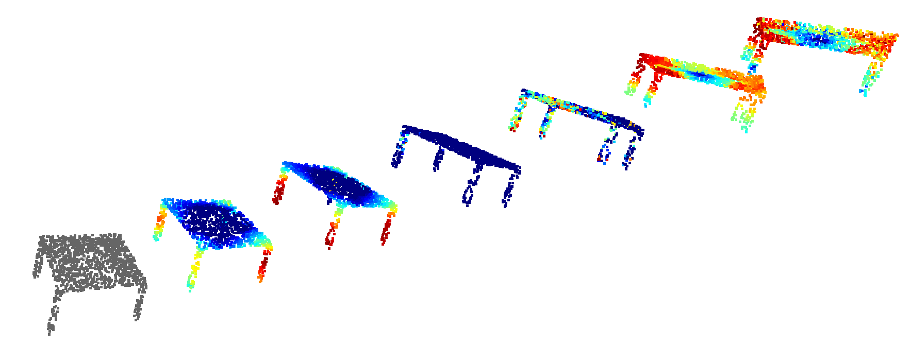

# Explaining Deep Neural Networks for Point Clouds using Gradient-based Visualisations
Created by Jawad Tayyub, Muhammad Sarmad, Nicolas Schönborn (equal contributions).

## Introduction and Abstract
This repository is the code release for our submission which is currently under review. An arxiv link will be added soon.

Explaining decisions made by deep neural networks is a rapidly advancing research topic. In recent years, several approaches have attempted to provide visual explanations of decisions made by neural networks designed for structured 2D image input data. In this paper, we propose a novel approach to generate coarse visual explanations of networks designed to classify unstructured 3D data, namely point clouds. Our method uses gradients flowing back to the final feature map layers and maps these values as contributions of the corresponding points in the input point cloud. Due to dimensionality disagreement and lack of spatial consistency between input points and final feature maps, our approach combines gradients with points dropping to compute explanations of different parts of the point cloud iteratively. The generality of our approach is tested on various point cloud classification networks, including 'single object' networks PointNet, PointNet++, DGCNN, and a 'scene' network VoteNet. Our method generates symmetric explanation maps that highlight important regions and provide insight into the decision-making process of network architectures. We perform an exhaustive evaluation of trust and interpretability of our explanation method against comparative approaches using quantitative, quantitative and human studies. All our code is implemented in PyTorch and will be made publicly available

In this repository, we provide the Point Grad CAM and PcSM code for Pointnet, Pointnet++ and DGCNN model implementations (with Pytorch) on ShapeNet data and pre-trained model.

## Setup 

The code has been tested with Python 3.7, CUDA 10.2 and PyTorch 1.2 on Ubuntu 18.04.

Pointnet++ works only on GPU with CUDA. For Pointnet and DGCNN, a GPU is optional.

- Install python (3.7)<br />
In case you use conda and want to create a new environment, you can use

```
conda create -n point-grad-cam
conda activate point-grad-cam
conda install -c anaconda python=3.7
```

- Install pytorch 1.2 (see https://pytorch.org/get-started/previous-versions/) <br />
For Linux or Windows users:
```
# CUDA 10.0
pip install torch===1.2.0 torchvision===0.4.0 -f https://download.pytorch.org/whl/torch_stable.html

# CUDA 9.2
pip install torch==1.2.0+cu92 torchvision==0.4.0+cu92 -f https://download.pytorch.org/whl/torch_stable.html

# CPU only
pip install torch==1.2.0+cpu torchvision==0.4.0+cpu -f https://download.pytorch.org/whl/torch_stable.html
```

- Install dependencies
```
pip install -r requirements.txt
```

- For Pointnet++, build the _ext module
```
python setup.py build_ext --inplace
```

- Download the ShapeNet dataset
```
sh download_shapenet_part16_catagories.sh
```

## Run experiments

### Visual experiments

The directory ```experiments_visual``` contains for each model and Grad Cam implementation an experiment that visualizes heatmaps for random test samples. They can be run individually, e.g. via ```python visual_pn1_L1.py```, or as a side-by-side comparison with ```python visual_comparison.py``` which should look similar to the following screenshot:


The comparison starts with a neutral gray colored instance on the left and continues with heatmaps in the following order:

- Pointnet
- Pointnet IHU
- DGCNN
- DGCNN IHU
- Pointnet++
- Pointnet++ APE

Notice: L1-LM can not be visualized as an individual heatmap as these are multiple heatmaps. IHU is one appraoch to merge these heatmaps.

### Point Dropping Experiment

The point dropping experiments are located in ```experiments_point_dropping``` and can be run individually, e.g. ```python experiment-1-pn1-L1.py```. The resulting diagrams will be saved in ```diagrams```. The experiments can take a few minutes up to a few hours depending on the model and explanation method. CUDA can accelerate the process by a order of magnitude.

Type ```python experiment-1-pn1-L1.py --help``` for a list of available arguments. To speed up the experiments, use the 
```--n_samples --n_drops --shuffle``` arguments, e.g.:

```
python experiment-1-pn1-L1.py --n_drops=1024 --n_samples=500 --shuffle
```

will reduce the runtime by a factor of roughly 11, as only 1024 out of 2048 points are dropped and only 500 of 2874 test samples are used. Shuffle is important to cover all classes with the reduce

